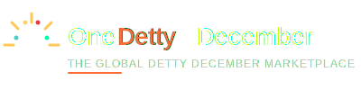

# OneDettyDecember Logo Package

## Overview

This package contains all official logo files for **OneDettyDecember** - The Global Detty December Marketplace.

## Design Inspiration

The OneDettyDecember logo was designed based on research of leading online travel and experience marketplaces:

### Competitive Reference Analysis

**Top Marketplaces Studied:**
1. **Viator** (TripAdvisor Experiences) - 55% market share
   - Clean, professional wordmark
   - Trust and authority
   
2. **GetYourGuide** - 20% market share
   - Modern, tech-forward design
   - Approachable and friendly
   
3. **Airbnb Experiences**
   - Minimalist and iconic
   - Community-focused
   
4. **Klook** 
   - Vibrant, targeting younger demographics
   - Playful yet professional

### Design Principles Applied

Our logo combines:
- **Professional marketplace aesthetics** (inspired by Viator and GetYourGuide)
- **West African cultural celebration** (vibrant colors, celebration bursts)
- **Modern digital design** (clean lines, scalable)
- **Memorable iconography** (the "1" with celebration elements)

## Logo Files Included

### 1. Primary Logo (`OneDettyDecember-Logo.svg`)
- Full logo with icon, wordmark, and tagline
- **Use:** Website headers, marketing materials, official documents
- **Colors:** Brand Orange (#FF6B35), Deep Navy (#1A1A2E), celebration accents
- **Format:** SVG (scalable vector)

### 2. Icon Only (`OneDettyDecember-Icon.svg`)
- Celebration "1" symbol with burst elements
- **Use:** Favicon, app icon, profile pictures, small spaces
- **Size:** 80x80px
- **Background:** Brand Orange circle
- **Format:** SVG (scalable vector)

### 3. Light Version (`OneDettyDecember-Logo-Light.svg`)
- Full logo optimized for dark backgrounds
- **Use:** Dark website themes, dark print materials
- **Colors:** White text with Brand Orange accent
- **Format:** SVG (scalable vector)

### 4. Brand Guidelines (`OneDettyDecember-Brand-Guidelines.md`)
- Complete brand identity system
- Color palettes, typography, usage rules
- **Reference:** For all brand applications

## Quick Usage Guide

### When to Use Each Version

| Context | Logo Version | Background |
|---------|-------------|------------|
| Website header | Primary Logo | White/Light |
| Mobile app | Icon Only | Orange circle |
| Dark mode website | Light Version | Dark Navy |
| Social media profile | Icon Only | Orange circle |
| Email signature | Primary (no tagline) | White |
| Merchandise | Icon or Wordmark | Varies |
| Print materials | Primary Logo | White/Light |
| Favicon | Icon Only | Transparent |

## Color Codes

### Primary Colors

**Brand Orange** (Celebration & Energy)
- HEX: `#FF6B35`
- RGB: `rgb(255, 107, 53)`
- CSS: `--brand-orange: #FF6B35;`

**Deep Navy** (Trust & Professionalism)
- HEX: `#1A1A2E`
- RGB: `rgb(26, 26, 46)`
- CSS: `--deep-navy: #1A1A2E;`

**Golden Yellow** (Joy)
- HEX: `#FFC857`
- RGB: `rgb(255, 200, 87)`
- CSS: `--golden-yellow: #FFC857;`

**White** (Clean & Space)
- HEX: `#FFFFFF`
- RGB: `rgb(255, 255, 255)`
- CSS: `--white: #FFFFFF;`

## Typography

**Primary Font:** Inter (Google Fonts)
- Weights: 400 (Regular), 600 (SemiBold), 700 (Bold), 900 (Black)
- Fallback: Arial, Helvetica, sans-serif

## Minimum Sizes

### Digital
- Full logo: **180px wide** minimum
- Icon only: **32px** minimum

### Print
- Full logo: **2 inches wide** minimum
- Icon only: **0.5 inches** minimum

## Clear Space

Always maintain clear space around the logo equal to the height of the "1" icon on all sides.

## File Formats

### SVG (Scalable Vector Graphics)
- **Best for:** Web, digital, scalability
- **Benefits:** Infinite scaling, small file size, editable

### Future Formats (To Be Created)

**PNG (Portable Network Graphics)**
- **Best for:** Digital with transparency
- **Sizes:** 512px, 1024px, 2048px

**JPG (Joint Photographic Experts Group)**
- **Best for:** Print, email, solid backgrounds
- **Quality:** 300 DPI for print

**PDF (Portable Document Format)**
- **Best for:** Print-ready, professional use
- **Benefits:** Vector format, universal compatibility

## Logo Usage Rules

### ✅ DO:
- Use official logo files only
- Maintain proper clear space
- Respect minimum sizes
- Use appropriate version for background
- Keep proportions locked
- Use high-resolution files

### ❌ DON'T:
- Stretch or distort the logo
- Rotate the logo
- Change the colors
- Separate icon from wordmark (unless using icon-only version)
- Add effects (shadows, gradients, etc.)
- Place on busy backgrounds without contrast
- Recreate or redraw the logo

## Technical Specifications

### Logo Components

**Icon Element:**
- Stylized "1" with celebration bursts
- Represents unity and celebration
- 7 burst rays with confetti dots
- Circular backdrop (subtle)

**Wordmark:**
- "One" - Deep Navy
- "Detty" - Brand Orange (accent)
- "December" - Deep Navy
- Tagline: "THE GLOBAL DETTY DECEMBER MARKETPLACE"

**Colors in Icon:**
- Main "1": Brand Orange or White
- Bursts: Golden Yellow (#FFC857)
- Confetti: Coral (#E63946), Mint (#06FFA5), Turquoise (#4ECDC4), Tan (#FFD166)

## Implementation Examples

### HTML Implementation
```html
<!-- Primary Logo -->


<!-- Icon Only -->


<!-- Light Version for Dark Backgrounds -->

```

### CSS Background Implementation
```css
.logo {
  background-image: url('OneDettyDecember-Logo.svg');
  background-size: contain;
  background-repeat: no-repeat;
  width: 400px;
  height: 120px;
}

.icon {
  background-image: url('OneDettyDecember-Icon.svg');
  background-size: contain;
  background-repeat: no-repeat;
  width: 80px;
  height: 80px;
}
```

### React Implementation
```jsx
import logo from './OneDettyDecember-Logo.svg';
import icon from './OneDettyDecember-Icon.svg';

function Header() {
  return (
    
  );
}

function AppIcon() {
  return (
    
  );
}
```

## Brand Consistency

For comprehensive brand guidelines including color usage, typography, photography style, and voice/tone, please refer to:

📄 **OneDettyDecember-Brand-Guidelines.md**

## Contact

**For Logo & Brand Assets:**
- Email: brand@onedettydecember.com
- Website: https://onedettydecember.com

**For Usage Permissions:**
- Email: legal@onedettydecember.com

## Version History

| Version | Date | Changes |
|---------|------|---------|
| 1.0 | Nov 10, 2025 | Initial logo design and brand system |

---

© 2025 OneDettyDecember Limited. All rights reserved.

**Note:** These logo files are proprietary and may only be used with permission from OneDettyDecember Limited. Unauthorized use, reproduction, or modification is prohibited.